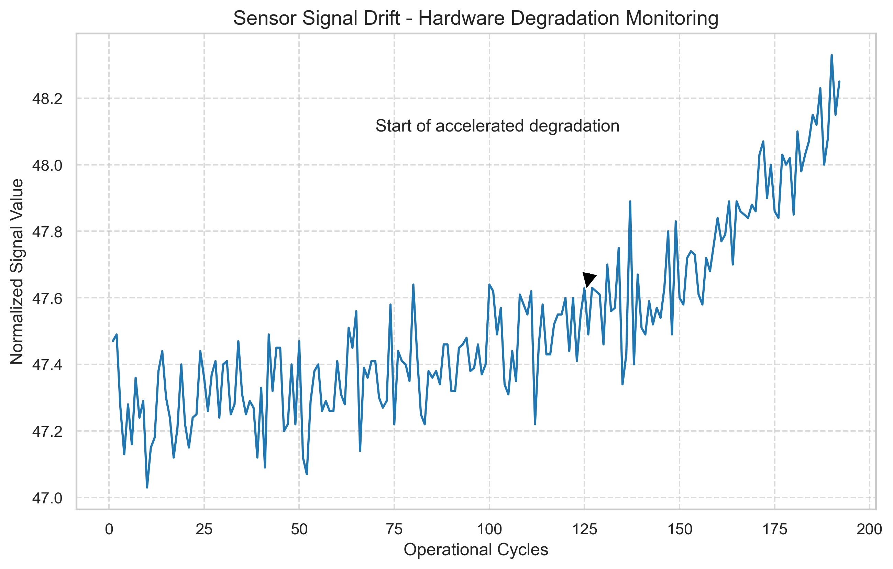

# Industrial AI & Automation Portfolio
### Luca Francone — Automation & Control Engineering

This repository showcases technical implementations of AI, Signal Processing, and Data Science applied to **Industrial Reliability**. My work focuses on bridging the gap between **Field Service Operations** and **Advanced Control Theory** to maximize asset uptime.

---

## 🚀 Key Projects

### 1. Fleet-Scale Remaining Useful Life (RUL) Prediction
* **Objective:** Developing predictive models to estimate the time-to-failure for turbofan engines, enabling proactive maintenance scheduling.
* **Dataset:** NASA CMAPSS (Turbofan Engine Degradation).
* **Technical Implementation:** * Time-series feature engineering and target RUL generation.
    * **Signal Drift Analysis:** Identification of physical degradation patterns in sensor telemetry.
    * Statistical correlation mapping for feature selection.
* **Key Results:** Successfully isolated "health indicators" (e.g., Sensor 11/12) showing clear hardware fatigue signals.

#### 📊 Signal Degradation Insight

*Figure 1: Observed signal drift in engine sensors, marking the transition from stable operation to accelerated hardware degradation.*

---

### 2. Anomaly Detection in Control Signals (Coming Soon)
* **Target:** Identifying sensor drift and hardware degradation in automated loops.
* **Methodology:** Utilizing Autoencoders and Residual Analysis to isolate faults before system-critical failure.
* **Key Skills:** Digital Signal Processing (DSP), Deep Learning (PyTorch), Control Theory.

---

## 🛠 Technical Stack & Engineering Expertise
* **Programming:** Python (Pandas, NumPy, Scikit-Learn, Seaborn)
* **Domain Expertise:** System Identification, Fault Detection & Isolation (FDI), Reliability Engineering.
* **Tools:** Jupyter Notebooks, Git/GitHub, MATLAB/Simulink.

---

## 📂 Repository Structure
* `01_Predictive_Maintenance_RUL/`: End-to-end RUL analysis using NASA datasets.
* `docs/`: General documentation and technical abstracts. 

